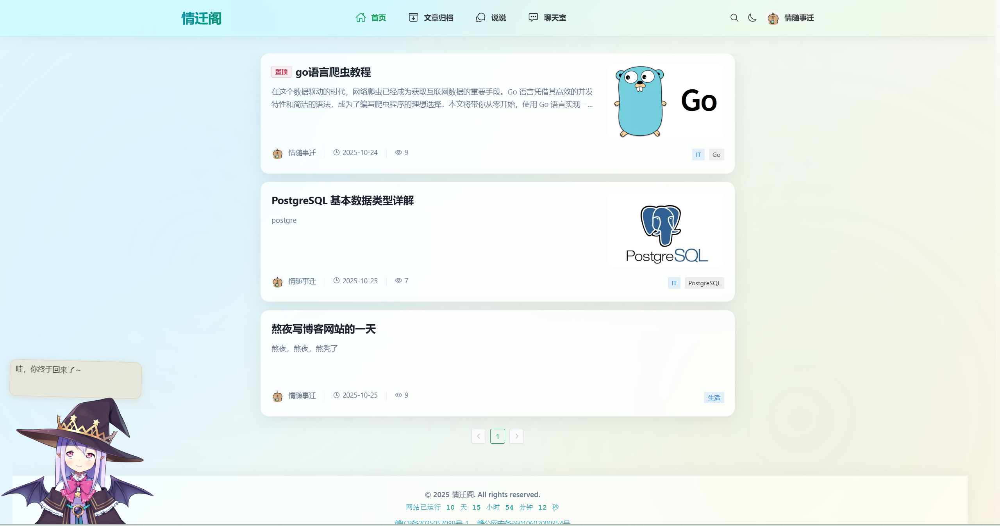
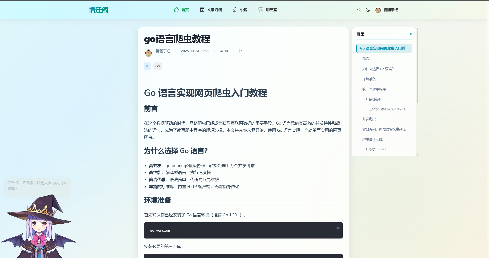
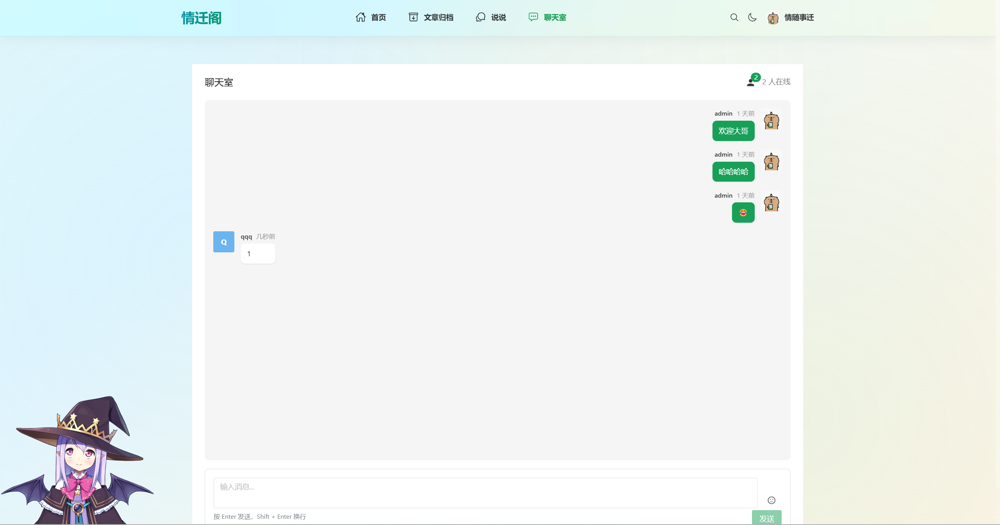
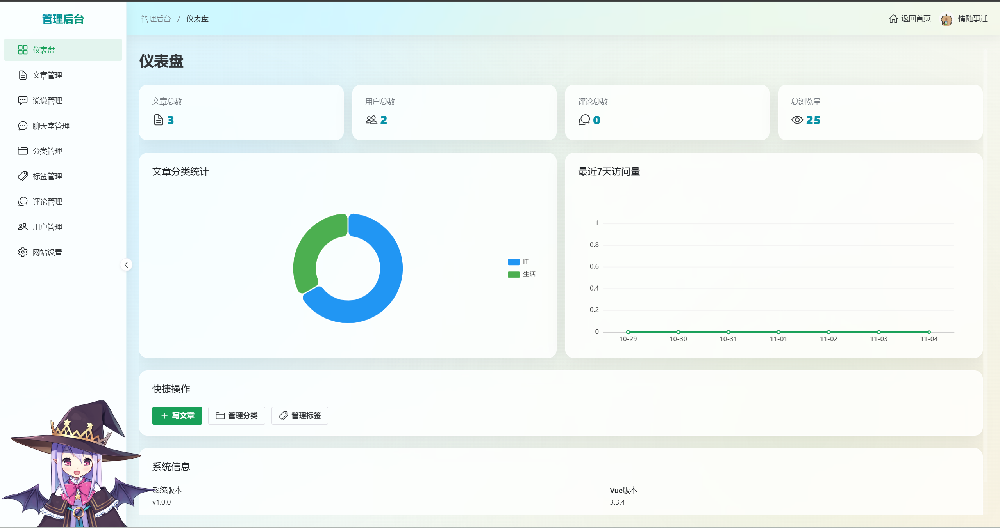

# 🎨 个人博客系统

一个基于 Vue 3 + Go 的现代化全栈博客系统，采用前后端分离架构，具有优雅的 UI 设计和完善的功能。


## 🌐 在线演示

**网站地址**: [https://blog.leadcode.top/](https://blog.leadcode.top/)

- 📱 支持 PC、平板、手机访问
- 💬 可以访问聊天室与其他用户实时交流
- 👤 支持匿名访问或注册登录

## 📸 项目截图

### 首页


### 文章详情


### 聊天室


### 管理后台


## ✨ 特性

### 🎯 核心功能
- 📝 **文章管理** - Markdown 编辑器，支持代码高亮、图片上传
- 🏷️ **分类标签** - 灵活的分类和标签系统
- 💬 **评论系统** - 支持嵌套回复的评论功能
- 💭 **说说动态** - 类似朋友圈的动态发布
- 💬 **实时聊天室** - WebSocket 实时通信，支持登录用户和匿名访问
- 👤 **用户系统** - 完整的用户注册、登录、权限管理
- 🔐 **安全认证** - 密码重置、邮箱修改、邮件验证码
- 🔒 **权限控制** - 基于角色的访问控制（RBAC）
- 📊 **数据统计** - 访问统计、文章统计、用户统计
- 🎨 **主题切换** - 支持亮色/暗色主题

### 🛠️ 技术特性
- 🚀 **现代化技术栈** - Vue 3 + TypeScript + Go + PostgreSQL
- 🎨 **优雅 UI** - Naive UI 组件库 + 玻璃态设计
- 📱 **响应式设计** - 完美适配各种设备（PC/平板/手机）
- ⚡ **高性能** - Vite 构建 + Pinia 状态管理 + 异步邮件发送
- 💬 **实时通信** - WebSocket 长连接 + 自动重连 + 心跳检测
- 🔐 **安全可靠** - JWT 认证 + 密码加密 + 邮箱验证 + IP 黑名单
- 🧹 **自动清理** - 定时清理过期数据，保持数据库整洁
- 📦 **易于部署** - Docker 支持 + 详细部署文档

## 🏗️ 项目结构

```
myBlog/
├── blog-frontend/          # 前端项目
│   ├── src/
│   │   ├── api/           # API 接口
│   │   ├── assets/        # 静态资源
│   │   ├── components/    # 公共组件
│   │   ├── layouts/       # 布局组件
│   │   ├── pages/         # 页面组件
│   │   ├── router/        # 路由配置
│   │   ├── stores/        # 状态管理
│   │   ├── types/         # TypeScript 类型
│   │   └── utils/         # 工具函数
│   ├── public/            # 公共资源
│   └── package.json
│
├── blog-backend/          # 后端项目
│   ├── cmd/
│   │   └── server/        # 服务入口
│   ├── config/            # 配置文件
│   ├── db/                # 数据库连接
│   ├── handler/           # 请求处理器
│   ├── middleware/        # 中间件
│   ├── model/             # 数据模型
│   ├── repository/        # 数据访问层
│   ├── service/           # 业务逻辑层
│   ├── util/              # 工具函数
│   ├── uploads/           # 上传文件
│   └── go.mod
│
└── README.md              # 项目说明
```

## 🚀 快速开始

### 环境要求

- **Node.js** >= 18.0.0
- **Go** >= 1.21
- **PostgreSQL** >= 15
- **pnpm** (推荐) 或 npm

### 1️⃣ 克隆项目

```bash
git clone https://gitee.com/qssq9398/go-vue3-blog.git
cd myBlog
```

### 2️⃣ 数据库配置

1. 创建 PostgreSQL 数据库（指定编码/排序，便于跨版本迁移一致）：
```sql
CREATE DATABASE blogdb
  WITH OWNER = postgres
       ENCODING = 'UTF8'
       LC_COLLATE = 'en_US.utf8'
       LC_CTYPE   = 'en_US.utf8'
       TEMPLATE   = template0;
```

2. 导入数据库结构：
```bash
cd blog-backend/sql
psql -U postgres -d blogdb -f init.sql
```

### 3️⃣ 后端配置与启动

```bash
cd blog-backend

# 1. 安装依赖
go mod download

# 2. 配置数据库连接和邮箱服务
# 编辑 config/config-dev.yml
vim config/config-dev.yml

# 配置邮箱服务（用于密码重置）
# email:
#   host: smtp.qq.com
#   port: 587
#   username: your-email@qq.com
#   password: your-auth-code  # QQ邮箱授权码
#   from_name: 情迁阁

# 3. 运行后端服务
go run cmd/server/main.go
```

后端服务默认运行在 `http://localhost:8080`

### 4️⃣ 前端配置与启动

```bash
cd blog-frontend

# 1. 安装依赖
# 如果没有安装pnpm，可全局安装：npm install -g pnpm
pnpm install

# 2. 配置 API 地址（可选）
# 创建 .env.development 文件
echo "VITE_API_BASE_URL=http://localhost:8080" > .env.development

# 3. 启动开发服务器
pnpm dev
```

前端服务默认运行在 `http://localhost:3000`

### 5️⃣ 访问系统

- **前台首页**: http://localhost:3000
- **管理后台**: http://localhost:3000/admin
- **默认管理员账号**: 
  - 用户名: `admin`
  - 密码: `password`

## ⚙️ 邮箱配置说明

### QQ邮箱授权码获取

1. 登录QQ邮箱网页版
2. 进入 **设置** → **账户**
3. 找到 **POP3/IMAP/SMTP/Exchange/CardDAV/CalDAV服务**
4. 开启 **POP3/SMTP服务** 或 **IMAP/SMTP服务**
5. 点击 **生成授权码**，按提示发送短信
6. 获得16位授权码，填入配置文件的 `password` 字段

### 其他邮箱配置

**163邮箱**:
```yaml
email:
  host: smtp.163.com
  port: 465
  username: your-email@163.com
  password: your-auth-code
  from_name: 情迁阁
```

**Gmail**:
```yaml
email:
  host: smtp.gmail.com
  port: 587
  username: your-email@gmail.com
  password: your-app-password
  from_name: 情迁阁
```

## 📦 生产部署

### 第一步：后端部署

#### 方式一：Docker Compose（推荐）

使用 Docker Compose 一键部署后端服务（包含 PostgreSQL、Redis、后端应用）：

#### 1. 编译后端程序

```bash
cd blog-backend

# Windows PowerShell
$env:GOOS="linux"; $env:GOARCH="amd64"; go build -o blog-backend ./cmd/server

# Linux/Mac
GOOS=linux GOARCH=amd64 go build -o blog-backend ./cmd/server
```

#### 2. 配置环境变量（可选）

创建 `docker-compose.yml` 同级的 `.env` 文件：

```env
# PostgreSQL 配置
POSTGRES_PASSWORD=your_postgres_password
POSTGRES_DB=blogdb

# Redis 配置
REDIS_PASSWORD=your_redis_password
```

或直接修改 `docker-compose.yml` 中的环境变量。

#### 3. 启动所有服务

```bash
# 构建并启动所有服务
docker compose up -d --build

# 查看服务状态
docker compose ps

# 查看日志
docker compose logs -f backend
```

#### 4. 初始化数据库

```bash
# 进入数据库容器
docker exec -it blog-postgres psql -U postgres -d blogdb

# 或从外部导入 SQL
docker exec -i blog-postgres psql -U postgres -d blogdb < sql/init.sql
```

#### 5. 服务管理

```bash
# 停止所有服务
docker compose down

# 停止并删除数据卷（谨慎使用！）
docker compose down -v

# 重启服务
docker compose restart backend

# 查看日志
docker compose logs -f backend
```

#### 服务访问地址：
- **后端 API**: `http://localhost:8080`
- **PostgreSQL**: `localhost:5632`
- **Redis**: `localhost:6379`

#### 方式二：本地编译部署
开始后端编译：
```bash
cd blog-backend
go build -o blog-backend cmd/server/main.go

# 运行
./blog-backend
```

手动在主机安装并启动 PostgreSQL、Redis，按需配置 `config/config-prod.yml`，再以服务方式管理可执行文件。

### 第二步：前端构建

```bash
cd blog-frontend
pnpm build
```

构建产物在 `dist` 目录，可部署到任何静态服务器（Nginx、Vercel、Netlify 等）。

### 第三步：Nginx 部署与反向代理

1. 将前端构建产物 `dist` 上传到服务器目录（如 `/var/www/blog`）。
2. 配置 Nginx（按需替换域名/路径/证书），无 SSL 示例：

```nginx
server {
    listen 80;
    server_name your-domain.com;   # 修改为你的域名/主机名

    # 前端静态资源目录（dist 构建产物）
    root /var/www/blog;
    index index.html;

    # 前端路由回退到 index.html（适配前端 history 模式）
    location / {
        try_files $uri $uri/ /index.html;
    }

    # 后端 API 反向代理
    location /api/ {
        proxy_pass http://127.0.0.1:8080/;  # 修改为后端实际地址
        proxy_set_header Host $host;
        proxy_set_header X-Real-IP $remote_addr;
        proxy_set_header X-Forwarded-For $proxy_add_x_forwarded_for;
        proxy_set_header X-Forwarded-Proto $scheme;
    }

    # WebSocket（如聊天），需保持连接与协议升级
    location /ws/ {
        proxy_pass http://127.0.0.1:8080/;  # 修改为后端实际地址
        proxy_http_version 1.1;
        proxy_set_header Upgrade $http_upgrade;
        proxy_set_header Connection "upgrade";
        proxy_set_header Host $host;
        proxy_set_header X-Real-IP $remote_addr;
        proxy_set_header X-Forwarded-For $proxy_add_x_forwarded_for;
        proxy_set_header X-Forwarded-Proto $scheme;
    }

    # 可选：静态资源缓存
    location ~* \.(js|css|png|jpg|jpeg|gif|svg|ico|woff2?)$ {
        try_files $uri =404;
        expires 30d;
        access_log off;
    }
}
```

3. HTTPS 示例（含 80→443 跳转，请替换证书路径）：

```nginx
# 80 强制跳转到 443
server {
    listen 80;
    server_name your-domain.com;   # 修改为你的域名/主机名
    return 301 https://$host$request_uri;
}

server {
    listen 443 ssl http2;
    server_name your-domain.com;   # 修改为你的域名/主机名

    # 证书路径（替换为实际证书文件）
    ssl_certificate     /etc/nginx/ssl/your-domain.com.crt;
    ssl_certificate_key /etc/nginx/ssl/your-domain.com.key;
    ssl_session_cache shared:SSL:10m;
    ssl_session_timeout 10m;
    ssl_protocols TLSv1.2 TLSv1.3;
    ssl_ciphers HIGH:!aNULL:!MD5;
    ssl_prefer_server_ciphers on;

    # 前端静态资源目录（dist 构建产物）
    root /var/www/blog;
    index index.html;

    # 前端路由回退
    location / {
        try_files $uri $uri/ /index.html;
    }

    # 后端 API 反代
    location /api/ {
        proxy_pass http://127.0.0.1:8080/;  # 修改为后端实际地址
        proxy_set_header Host $host;
        proxy_set_header X-Real-IP $remote_addr;
        proxy_set_header X-Forwarded-For $proxy_add_x_forwarded_for;
        proxy_set_header X-Forwarded-Proto $scheme;
    }

    # WebSocket（如聊天）
    location /ws/ {
        proxy_pass http://127.0.0.1:8080/;  # 修改为后端实际地址
        proxy_http_version 1.1;
        proxy_set_header Upgrade $http_upgrade;
        proxy_set_header Connection "upgrade";
        proxy_set_header Host $host;
        proxy_set_header X-Real-IP $remote_addr;
        proxy_set_header X-Forwarded-For $proxy_add_x_forwarded_for;
        proxy_set_header X-Forwarded-Proto $scheme;
    }

    # 可选：静态资源缓存
    location ~* \.(js|css|png|jpg|jpeg|gif|svg|ico|woff2?)$ {
        try_files $uri =404;
        expires 30d;
        access_log off;
    }
}
```

4. 重载 Nginx：`nginx -s reload` 或 `systemctl reload nginx`。

### 第四步：数据迁移（可选，新旧数据库切换时使用）

1. 备份旧库（PostgreSQL 示例）：
```bash
pg_dump -h old-host -U old_user -d old_db -Fc -f backup.dump
```
参数说明：
- `-h old-host`：旧数据库主机
- `-U old_user`：旧库用户名
- `-d old_db`：旧库库名
- `-Fc`：自定义格式（便于 pg_restore 增强选项）
- `-f backup.dump`：输出文件路径
示例：
```bash
pg_dump -h 10.0.0.5 -U bloguser -d blogdb -Fc -f /tmp/blog_backup_2025-12-15.dump
```

2. 恢复到新库：
```bash
pg_restore -h new-host -U new_user -d new_db --clean --if-exists backup.dump
```
参数说明：
- `-h new-host`：新数据库主机
- `-U new_user`：新库用户名
- `-d new_db`：新库库名
- `--clean`：导入前先 DROP 现有对象
- `--if-exists`：仅在对象存在时执行 DROP，减少报错
- `backup.dump`：备份文件路径
示例：
```bash
pg_restore -h 127.0.0.1 -U postgres -d blogdb --clean --if-exists /tmp/blog_backup_2025-12-15.dump
```
3. 如使用 Docker Compose，可在容器内执行：
```bash
docker exec -i blog-postgres pg_restore -U postgres -d blogdb --clean --if-exists < backup.dump
```
4. 确认新库的连接信息已写入 `config/config-prod.yml` 或环境变量，并与 Nginx/后端代理地址匹配。
5. 如不需要历史会话，可清理 Redis（如果有登录态存储），再重启后端。

## 🎨 主要功能模块

### 📝 文章管理
- Markdown 编辑器，支持实时预览
- 代码高亮（支持多种编程语言）
- 图片上传和管理
- 文章分类和标签
- 文章置顶和草稿
- 点赞和浏览统计

### 💬 评论系统
- 支持嵌套回复
- 评论审核
- 评论状态管理
- 用户头像显示

### 💭 说说动态
- 发布图文动态
- 多图上传（最多9张）
- 点赞功能
- 公开/私密状态

### 👤 用户中心
- 用户注册和登录
- 个人资料编辑
- 头像上传
- 密码修改
- 忘记密码（邮箱验证码）
- 邮箱修改（限制一年2次）

### 💬 聊天室功能
- 实时 WebSocket 通信
- 支持登录用户和匿名访问
- 在线人数统计（按用户去重）
- 消息历史记录（最近50条）
- 表情符号选择器
- 管理员右键菜单功能：
  - 右键消息删除
  - 右键头像踢出用户
- 管理后台功能：
  - 批量删除消息
  - 发送系统广播
  - 踢出在线用户
  - 封禁IP地址
- 移动端响应式适配

### 🔧 管理后台
- 📊 仪表盘数据统计（访问统计、分类统计）
- 📝 文章管理
- 🏷️ 分类标签管理
- 💬 评论管理
- 💭 说说管理
- 💬 聊天室管理（消息管理、用户管理）
- 👥 用户管理
- ⚙️ 网站设置
- 🚫 IP 黑名单管理

## 🛠️ 技术栈

### 前端技术
- **框架**: Vue 3.3 + TypeScript
- **构建工具**: Vite 5
- **UI 组件**: Naive UI
- **状态管理**: Pinia
- **路由**: Vue Router 4
- **HTTP 客户端**: Axios
- **Markdown**: @kangc/v-md-editor
- **代码高亮**: Prism.js
- **图表**: ECharts
- **工具库**: VueUse、Day.js

### 后端技术
- **语言**: Go 1.21+
- **Web 框架**: Gin
- **ORM**: GORM
- **数据库**: PostgreSQL
- **缓存**: Redis
- **认证**: JWT
- **WebSocket**: Gorilla WebSocket
- **邮件发送**: SMTP (支持QQ邮箱、163邮箱等)
- **日志**: 自定义日志中间件
- **配置**: Viper (YAML)
- **密码加密**: bcrypt
- **定时任务**: Go 原生 Goroutine + Timer

## 📖 API 文档

### 认证相关
- `POST /api/auth/register` - 用户注册
- `POST /api/auth/login` - 用户登录
- `POST /api/auth/logout` - 用户登出
- `POST /api/auth/refresh` - 刷新Token
- `GET /api/auth/profile` - 获取用户信息
- `PUT /api/auth/profile` - 更新用户信息
- `PUT /api/auth/password` - 修改密码
- `POST /api/auth/forgot-password` - 忘记密码（发送验证码）
- `POST /api/auth/reset-password` - 重置密码
- `PUT /api/auth/email` - 修改邮箱
- `GET /api/auth/email-change-info` - 获取邮箱修改信息

### 文章相关
- `GET /api/posts` - 获取文章列表
- `GET /api/posts/:id` - 获取文章详情
- `GET /api/posts/archives` - 获取归档
- `GET /api/posts/hot` - 获取热门文章
- `GET /api/posts/recent` - 获取最新文章
- `POST /api/posts` - 创建文章（需认证）
- `PUT /api/posts/:id` - 更新文章（需认证）
- `DELETE /api/posts/:id` - 删除文章（需认证）
- `POST /api/posts/:id/like` - 点赞文章

### 分类相关
- `GET /api/categories` - 获取分类列表
- `GET /api/categories/:id` - 获取分类详情
- `POST /api/categories` - 创建分类（管理员）
- `PUT /api/categories/:id` - 更新分类（管理员）
- `DELETE /api/categories/:id` - 删除分类（管理员）

### 标签相关
- `GET /api/tags` - 获取标签列表
- `GET /api/tags/:id` - 获取标签详情
- `GET /api/tags/:id/posts` - 获取标签下的文章
- `POST /api/tags` - 创建标签（需认证）
- `PUT /api/tags/:id` - 更新标签（需认证）
- `DELETE /api/tags/:id` - 删除标签（需认证）

### 评论相关
- `GET /api/comments/post/:id` - 获取文章评论
- `POST /api/comments` - 创建评论（需认证）
- `PUT /api/comments/:id` - 更新评论（需认证）
- `DELETE /api/comments/:id` - 删除评论（需认证）

### 说说相关
- `GET /api/moments` - 获取说说列表
- `GET /api/moments/:id` - 获取说说详情
- `GET /api/moments/recent` - 获取最新说说
- `POST /api/moments` - 发布说说（需认证）
- `PUT /api/moments/:id` - 更新说说（需认证）
- `DELETE /api/moments/:id` - 删除说说（需认证）
- `POST /api/moments/:id/like` - 点赞说说

### 上传相关
- `POST /api/upload/avatar` - 上传头像（需认证）
- `POST /api/upload/image` - 上传图片（需认证）

### 设置相关
- `GET /api/settings/public` - 获取公开设置
- `GET /api/settings/site` - 获取网站设置（管理员）
- `PUT /api/settings/site` - 更新网站设置（管理员）

### 验证码相关
- `GET /api/captcha` - 获取图形验证码

### 聊天室相关
- `WS /api/chat/ws` - WebSocket 连接（支持登录用户和匿名访问）
- `GET /api/chat/messages` - 获取消息列表
- `GET /api/chat/online` - 获取在线信息

### 管理后台相关
- `GET /api/admin/dashboard/stats` - 仪表盘统计
- `GET /api/admin/dashboard/category-stats` - 分类统计
- `GET /api/admin/dashboard/visit-stats` - 访问统计
- `GET /api/admin/users` - 用户列表
- `PUT /api/admin/users/:id/status` - 更新用户状态
- `DELETE /api/admin/users/:id` - 删除用户
- `GET /api/admin/posts` - 所有文章
- `GET /api/admin/comments` - 所有评论
- `PUT /api/admin/comments/:id/status` - 更新评论状态
- `GET /api/admin/moments` - 所有说说
- `GET /api/admin/ip-blacklist` - IP黑名单列表
- `POST /api/admin/ip-blacklist` - 添加IP黑名单
- `DELETE /api/admin/ip-blacklist/:id` - 删除IP黑名单
- `GET /api/admin/ip-blacklist/check` - 检查IP状态
- `POST /api/admin/ip-blacklist/clean-expired` - 清理过期IP
- `GET /api/admin/chat/messages` - 聊天消息列表（管理员）
- `DELETE /api/admin/chat/messages/:id` - 删除消息（管理员）
- `POST /api/admin/chat/broadcast` - 发送系统广播（管理员）
- `POST /api/admin/chat/kick` - 踢出用户（管理员）
- `POST /api/admin/chat/ban` - 封禁IP（管理员）

更多详细说明请参考 [后端文档](./blog-backend/README.md)

## 🎯 开发指南

### 代码规范
- 使用 ESLint + Prettier 格式化代码
- 遵循 Vue 3 Composition API 风格
- TypeScript 严格模式
- Git Commit 规范

### 目录说明
详见各子项目的 README：
- [前端文档](./blog-frontend/README.md)
- [后端文档](./blog-backend/README.md)

## 🤝 贡献指南

欢迎提交 Issue 和 Pull Request！

1. Fork 本仓库
2. 创建特性分支 (`git checkout -b feature/AmazingFeature`)
3. 提交更改 (`git commit -m 'Add some AmazingFeature'`)
4. 推送到分支 (`git push origin feature/AmazingFeature`)
5. 提交 Pull Request

## 📝 更新日志

### v1.2.0 (2025-11-04)
- ✨ 新增实时聊天室功能
  - 💬 WebSocket 实时通信
  - 👥 支持登录用户和匿名访问
  - 📊 在线人数统计（按用户去重）
  - 🔄 自动重连机制
  - ❤️ 心跳检测保持连接
  - 📜 消息历史记录
  - 😀 表情符号选择器
- 🛡️ 管理员权限功能
  - 右键消息删除
  - 右键头像踢出用户
  - 批量删除消息
  - 发送系统广播
  - IP 封禁管理
- 📱 移动端完美适配
- 🐛 修复在线人数统计bug

### v1.1.0 (2025-10-28)
- ✨ 新增忘记密码功能（邮箱验证码）
- ✨ 新增邮箱修改功能（限制一年2次）
- 🔐 邮件验证码安全认证
- ⚡ 异步邮件发送，提升响应速度
- 🧹 自动清理过期验证码（每小时）
- 🎨 优化认证页面UI

### v1.0.0 (2025-10-25)
- ✨ 初始版本发布
- 📝 完整的文章管理系统
- 💬 评论系统
- 💭 说说功能
- 🎨 主题切换
- 📊 数据统计
- 🔐 权限管理

## 📄 许可证

本项目采用 MIT 许可证 - 详见 [LICENSE](LICENSE) 文件

## 👨‍💻 作者

**情随事迁**

## 🙏 致谢

- [Vue.js](https://vuejs.org/)
- [Naive UI](https://www.naiveui.com/)
- [Gin](https://gin-gonic.com/)
- [GORM](https://gorm.io/)
- 所有贡献者

## 📮 联系方式

如有问题或建议，欢迎通过以下方式联系：

- 📧 Email: 2665339398@qq.com


---

⭐ 如果这个项目对你有帮助，请给个 Star 支持一下！

